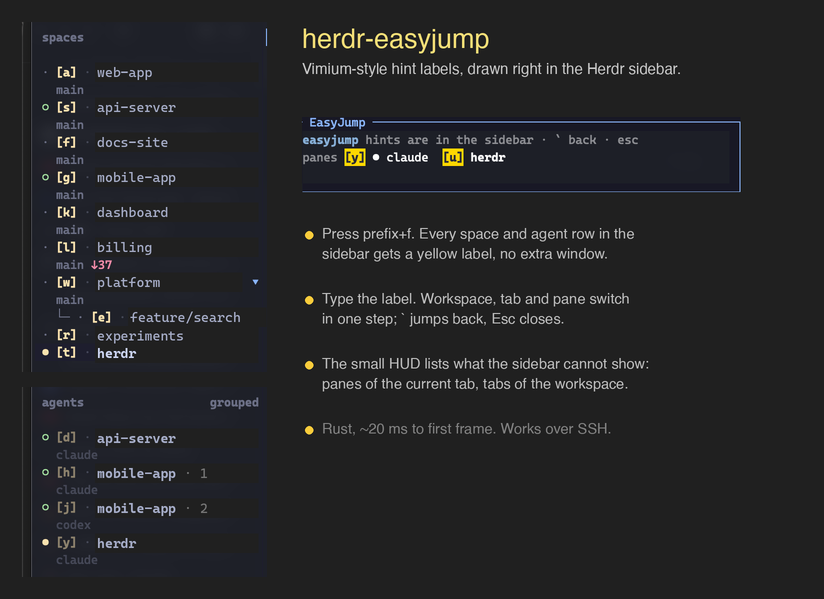

# herdr-easyjump

Hint-label jumping for [Herdr](https://herdr.dev), in the spirit of
EasyMotion / hop.nvim / Vimium / vim-choosewin: press a key, type a letter,
land on any space, agent, pane, or tab.

Press one key and every space and agent row **in the sidebar itself** gets a
yellow label. Type the label and you are there. Panes of the current tab and
tabs of the current workspace get their labels in a tiny HUD popup, because
the sidebar has no rows for them.

Everything is drawn by Herdr: the sidebar labels are metadata tokens, the HUD
is a Herdr terminal popup. There is no separate window, so the outer terminal
(Ghostty, iTerm2, WezTerm, Kitty, …) never loses focus, and it works over
`herdr --remote` / SSH.



Labels are single letters while there are 21 or fewer targets, two letters
beyond that. The alphabet is home-row first (`asdfg`, `wertyuiop`,
`zxcvbnm`). `h` `j` `k` `l` are reserved for relative movement and `q` for
quitting, so they never appear in a label.

## Requirements

- Herdr 0.8.2 or newer (plugin popup placement, metadata tokens)
- A Rust toolchain (`cargo`); `herdr plugin install` runs
  `cargo build --release`. Four small dependencies: serde, serde_json, libc,
  unicode-width. No TUI framework.
- Works with the sidebar expanded or collapsed. A collapsed sidebar cannot
  render the labels, so the HUD then lists the spaces and agents itself.

## Install

```bash
herdr plugin install <owner>/herdr-easyjump
```

or, for a local checkout:

```bash
cargo build --release
herdr plugin link /path/to/herdr-easyjump
```

### Config

Two things in `~/.config/herdr/config.toml`: a key binding, and the `$hint`
token in the sidebar rows so Herdr has somewhere to draw the labels. The
token is empty whenever easyjump is not running, and empty tokens take no space.

```toml
[[keys.command]]
key = "prefix+f"
type = "plugin_action"
command = "xzedx.easyjump.open"
description = "easyjump: hint jump"

# Alternative: let Herdr open the popup directly, skipping the `--open` hop.
# The size is fixed, so give it enough rows for the collapsed-sidebar HUD
# (header, spaces, agents, panes, tabs; a big session may want 8 or more).
# Use the absolute path of the checkout, or the managed one from
# `herdr plugin list`.
# [[keys.command]]
# key = "prefix+f"
# type = "popup"
# command = "/path/to/herdr-easyjump/target/release/herdr-easyjump"
# width = 96
# height = 8
# description = "easyjump: hint jump"

# optional: jump back to where you were before the last hop
[[keys.command]]
key = "prefix+shift+f"
type = "plugin_action"
command = "xzedx.easyjump.back"
description = "easyjump: jump back"

# optional: the older all-in-one list popup with a pane mini-map
[[keys.command]]
key = "prefix+alt+f"
type = "plugin_action"
command = "xzedx.easyjump.open-list"
description = "easyjump: list popup"

# These are Herdr's default rows plus the $hint token. If you already
# customise rows, just add the token entry wherever you want the label.
[ui.sidebar.spaces]
rows = [["state_icon", { token = "$hint", fg = "#f9e2af", bold = true }, "workspace"], ["branch", "git_status"]]

[ui.sidebar.agents]
rows = [["state_icon", { token = "$hint", fg = "#f9e2af", bold = true }, "workspace", "tab"], ["agent"]]
```

```bash
herdr server reload-config
```

## Usage

Press `prefix+f`.

- Every space row and agent row in the sidebar shows `[x]`. Type `x` to jump
  there. A space label focuses that workspace's active tab; an agent label
  focuses that agent's pane, switching workspace and tab as needed.
- Panes of the current tab show `[x]` on their border (a display-only title
  override with a TTL, so it vanishes on its own if the plugin dies). Tabs of
  the current workspace show their hint in the tab bar: a custom-named tab
  gets a `[x]` prefix while the popup is open, an auto-numbered tab keeps its
  number and that digit is the key. The HUD repeats the pane and tab hints.
- With the sidebar collapsed to its icon rail the labels have nowhere to go,
  so the HUD also lists every space and agent, wrapped to the popup width.
  Herdr does not report the sidebar state; the plugin infers it from where
  the pane area starts (`EASYJUMP_SIDEBAR=collapsed|expanded` overrides the
  guess for debugging).
- With two-letter labels, typing the first letter hides every label that no
  longer matches, in the sidebar and in the HUD.
- `h` `j` `k` `l` move focus to the neighbouring pane, `J` / `K` switch to
  the next / previous space, all without closing the popup. Labels and the
  HUD follow the new focus, so you can mix relative moves and label jumps.
- `` ` `` (backtick) jumps back to where you were when the popup opened,
  even after a chain of relative moves.
- `Enter` keeps the current focus and closes (after relative moves this is
  the "confirm"). With a unique typed prefix it jumps there instead.
- `Esc`, `q`, or `Ctrl-C` undoes: focus returns to where it was when the
  popup opened, then the popup closes.
- `Backspace` clears the typed prefix.

## How it works

1. The `open` action asks Herdr to open the `jump` popup (a fixed 64x5 cells);
   nothing else runs before the popup process itself.
2. The popup process reads the session snapshot over the Herdr socket,
   assigns labels in sidebar order, and publishes the labels as `hint` metadata tokens
   (`workspace.report_metadata` / `pane.report_metadata`) with a 30 second
   TTL, so labels disappear on their own even if the process is killed.
3. A keystroke becomes one `pane.focus`, `tab.focus`, or `workspace.focus`
   request. On exit the tokens are cleared explicitly.
4. The previous pane id is written to `HERDR_PLUGIN_STATE_DIR/last.json` for
   jump-back.

## Development

```bash
cargo build --release
herdr plugin link "$PWD"
./target/release/herdr-easyjump --dump --sidebar               # HUD text + label map
COLUMNS=140 LINES=30 ./target/release/herdr-easyjump --dump    # list-mode frame
herdr plugin action invoke xzedx.easyjump.open
EASYJUMP_TRACE=/tmp/easyjump-trace.txt ./target/release/herdr-easyjump  # per-stage timestamps
```

Latency on an M-series Mac, measured from the `plugin.pane.open` request:
the popup process starts after about 10-15 ms and has drawn its first frame
and published every sidebar label after about 15-25 ms. The binary itself
starts in about 3 ms; the rest is Herdr spawning the popup.

The first version was Python (see git history). It worked the same way but
needed 60-80 ms, most of it interpreter start-up.

## License

MIT
